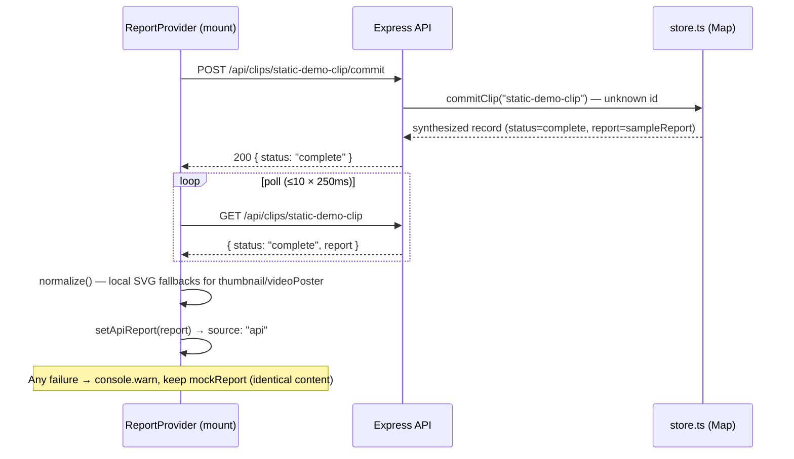
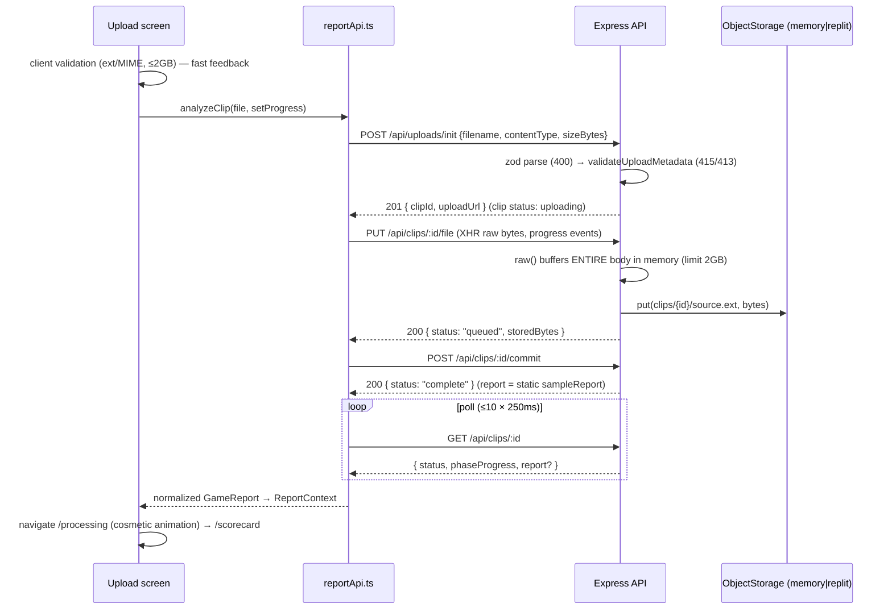

# ChelCoach — Engineering Knowledge Base

Internal onboarding reference for engineers joining ChelCoach. Everything in this document
was verified directly from the code as of commit `3f6c0e2` (`main`). Where something could
not be verified from the repository, it is explicitly marked **[unverified]**.

Companion docs: [backend-plan.md](backend-plan.md) (the full backend roadmap),
[phase-status.md](phase-status.md) (what is built), [backend-setup-replit.md](backend-setup-replit.md)
(Phase-0 setup notes), and the project guardrails in `.claude/skills/chelcoach/SKILL.md`.

---

## 1. Executive Summary

ChelCoach is a **conversion-first product MVP**: an AI-gameplay-coaching experience for
competitive EA Sports NHL ("Chel") players. A user uploads one game clip, receives a free
**Chel Rating** scorecard, previews locked "film-room" coaching moments, and hits a paywall
that (mock-)unlocks the Full Film Room. There is **no real AI, no video processing, no
payments, and no auth** — this is deliberate scope, not missing work.

The repository contains **three isolated npm projects**:

| Project | Location | Stack | Role |
|---|---|---|---|
| Frontend | repo root (`src/`) | React 19, Vite 8, TypeScript 6, Tailwind 3, React Router 6 | The entire product experience; runs fully on mock data by default |
| Backend | `server/` | Node 22, Express 5, TypeScript 5.9 (run via `tsx`, no build step), Zod | Contract-validated upload → report API (Phase 2 of the backend plan) |
| Shared | `shared/` | Zod | The **Analysis Contract** — single source of truth for the report shape |

Backend build-out state (per `docs/phase-status.md`, confirmed against code):
Phases 0–2 are complete (contract, static-report loop, real upload into object storage).
Phase 3 (ffmpeg frame extraction) is next. AI analysis, Postgres persistence, auth, and
payments are explicitly deferred.

Everything is green as verified in this workspace on Node 22.14:
`npm run build` (tsc + Vite), `npm run lint` (oxlint), server `npm run typecheck`, and the
server smoke test (`npm run smoke`, 9/9 checks).

---

## 2. Repository Architecture

```
chelcoach/
├─ src/                        Frontend (project 1 — root package.json)
│  ├─ main.tsx                 Entry: fonts/icons, provider tree, BrowserRouter
│  ├─ App.tsx                  Flat route table (7 routes + fallback)
│  ├─ screens/                 One file per conversion-loop step (7 screens)
│  ├─ components/              10 reusable UI primitives + tone.ts style maps
│  ├─ state/                   3 contexts: Premium, Analysis, Report
│  ├─ lib/reportApi.ts         Backend read/upload path (feature-flagged)
│  ├─ data/mockData.ts         ALL mock analysis content, upload rules, UX copy
│  ├─ assets/                  6 local SVGs (moment stills, poster, dashboard, avatar)
│  ├─ index.css                Design-system utilities, animations, a11y helpers
│  └─ vite-env.d.ts
├─ shared/                     Shared contract (project 2 — own package.json, dep: zod)
│  └─ analysisContract.ts      Zod schemas + inferred types + upload rules + API envelopes
├─ server/                     Backend (project 3 — own package.json)
│  ├─ src/index.ts             Entry (app.listen on PORT | 3001)
│  ├─ src/app.ts               Express app: CORS, JSON body, routers, 404, error handler
│  ├─ src/routes/              health.ts, uploads.ts, clips.ts
│  ├─ src/store.ts             In-memory clip store (Map) + lifecycle state machine
│  ├─ src/storage.ts           Object-storage abstraction: memory | replit backends
│  ├─ src/data/sampleReport.ts Deterministic report, schema-validated at module load
│  ├─ src/db/schema.ts         Drizzle Postgres schema (staged, NOT used at runtime)
│  ├─ src/db/client.ts         Lazy pg/Drizzle client (server boots without DATABASE_URL)
│  ├─ src/contract.ts          Re-export of ../../shared/analysisContract
│  ├─ src/smoke.ts             Dependency-free end-to-end smoke test (9 checks)
│  └─ drizzle.config.ts        drizzle-kit config (migrations; not runtime)
├─ public/                     favicon.svg, icons.svg — see "Known Limitations" (unreferenced)
├─ docs/                       backend-plan.md, phase-status.md, backend-setup-replit.md
├─ .github/workflows/ci.yml    CI: shared install → frontend build → server typecheck + smoke
├─ .claude/                    launch.json (npm run dev @ 5173) + chelcoach skill (guardrails)
├─ replit.nix                  Nix env: nodejs_22 (ffmpeg commented out until Phase 3)
├─ tailwind.config.js          "Pro Ice Analytics" design tokens
├─ tsconfig.json / .app / .node  Project references (app: src; node: vite.config.ts)
├─ vite.config.ts              Minimal: @vitejs/plugin-react only
├─ .oxlintrc.json              oxlint: react + typescript + oxc plugins
└─ .env.example                Frontend flags (all optional); server/.env.example for the API
```

**Isolation guarantee:** the frontend's `tsconfig.app.json` includes only `src`, and the
frontend build never compiles `server/`. The server's `tsconfig.json` includes `src`,
`drizzle.config.ts`, and `../shared/**/*.ts`. Each project has its own lockfile
(`package-lock.json`, `server/package-lock.json`, `shared/package-lock.json`).

Git history is short and clean (4 commits): contract foundation → repo status doc →
Phase 2 upload PR (#1) → README.

---

## 3. Frontend Architecture

### 3.1 Application lifecycle & provider tree

`src/main.tsx` renders, in order: self-hosted fonts (`@fontsource` Oswald/Inter/JetBrains
Mono) and `material-symbols/outlined.css` (no network font/icon dependencies), then:

```
<StrictMode>
  <BrowserRouter>            (v7 future flags enabled)
    <PremiumProvider>        isPremium / unlock() / reset()          — mock paywall flag
      <AnalysisProvider>     hasAnalysis / markAnalyzed() / reset()  — "has a report" flag
        <ReportProvider>     report / source / analyzeClip()         — mock vs API report source
          <App />            flat <Routes>
```

All three contexts are in-memory `useState` only — **a page refresh resets premium status
and analysis state**. There is no persistence (by design at this stage).

### 3.2 Routing (`src/App.tsx`)

Intentionally flat — one route per conversion step, wildcard falls back to Landing:

| Route | Screen | Conversion step |
|---|---|---|
| `/` | `Landing` | Hook + "Analyze My Gameplay" / "View Demo Report" |
| `/upload` | `Upload` | Drag-drop clip picker + validation |
| `/processing` | `Processing` | Staged "AI review" animation |
| `/scorecard` | `Scorecard` | Free Chel Rating scorecard (conversion moment #1) |
| `/film-preview` | `FilmPreview` | Locked coaching moments (conversion moment #2) |
| `/paywall` | `Paywall` | Benefit cards + "Start My Free Trial" (mock unlock) |
| `/film-room` | `FilmRoom` | Full breakdown (timeline, commentary, plan) |
| `*` | `Landing` | Fallback |

### 3.3 State management

- **`PremiumContext`** — the mock paywall. `Paywall.startTrial()` calls `unlock()` and
  navigates to `/film-room`. Nothing else writes it. `reset()` exists but is currently
  uncalled from any screen.
- **`AnalysisContext`** — whether this session "has" an analysis. Written by:
  Landing ("View Demo Report"), Processing (on completion / skip), and FilmRoom's empty
  state ("View Demo Report"). Read only by FilmRoom to choose its empty state.
- **`ReportContext`** — the report the screens render. Defaults to `mockReport` from
  `src/data/mockData.ts`. When `VITE_USE_BACKEND_REPORTS=true`, it (a) on mount commits the
  fixed demo clip against the API and swaps in the fetched report, and (b) exposes
  `analyzeClip(file, onProgress)` used by the Upload screen for real uploads. **Any backend
  failure silently keeps the identical-content mock report** (logged as a `console.warn`).

### 3.4 Component inventory (`src/components/`)

Reusable primitives (reuse these before writing new ones — skill rule):

- `Button` — primary / ghost / ice variants, md/lg sizes, leading/trailing icons.
- `GlassPanel` — the Level-1 glassmorphic surface used by every data card.
- `Icon` — Material Symbols Outlined wrapper (`fill` prop switches font-variation FILL).
- `MetricCard` — one scorecard metric with tone-colored glowing progress bar.
- `CoachingMomentCard` — moment thumbnail + teaser + (optionally locked) full breakdown;
  the lock is a `.premium-blur` overlay with an "Unlock Full AI Analysis" CTA.
- `StatePanel` — the standard empty/error panel (icon, title = what happened, message =
  what to do, primary/secondary actions). Used by Processing (failure), Scorecard
  (data-unavailable), FilmRoom (empty + data-unavailable).
- `TopAppBar`, `BottomNav`, `Logo`, `AtmosphereBackground` — shared chrome.
- `tone.ts` — the semantic tone→class maps (`toneText`, `toneBar`, `toneGlow`,
  `momentStyles`). `good`→tertiary (green), `warn`→primary (blue), `bad`→error (crimson).

Central components: `GlassPanel`, `Icon`, `Button`, and `tone.ts` appear on effectively
every screen; `StatePanel` is the single pattern for all non-happy-path states.

### 3.5 Screens — behavior notes (verified)

- **Landing** — static hero + 4-step cards. "View Demo Report" calls `markAnalyzed()` then
  goes straight to `/scorecard` (skips upload/processing). The "Sign In" button is
  decorative (no handler).
- **Upload** — client-side validation (extension **or** MIME accepted; ≤ 2 GB) using the
  frontend copy of `uploadRules` in `mockData.ts`, with player-friendly error copy
  (`uploadErrors`). Flag off: "Get My Chel Rating" navigates directly to `/processing`
  (no upload occurs). Flag on: performs the real init → PUT (XHR, progress bar) → commit →
  poll sequence via `ReportContext.analyzeClip`, then navigates to `/processing`. The
  "Storage Status 72% Full" panel is hardcoded decoration.
- **Processing** — a purely **cosmetic** ~10-second staged animation (progress ticks on a
  `setTimeout` loop; message index derived from progress; "Analyzed Frames" is a random
  counter). It does not poll the backend in either mode. A mock failure path is armed only
  by visiting `/processing?state=fail` (fails at 42%, retry succeeds). On completion it
  calls `markAnalyzed()` and auto-navigates to `/scorecard` after 1.1 s ("Skip to
  Scorecard" available throughout).
- **Scorecard** — renders `report.scorecard`; falls back to the `dataUnavailable`
  StatePanel if `scorecard.metrics` is missing/empty (cannot happen with mock data). The
  conversion CTA copy hardcodes "42 coaching moments" and "four high-danger chances" —
  not derived from report data.
- **FilmPreview** — renders `report.coachingMoments`. The first (`great`) moment is shown
  unlocked as a trust-builder; the other two are locked. Unlock routes to `/paywall` when
  `!isPremium`, else `/film-room`. Hardcodes "42 coaching moments" / "39 moments".
- **Paywall** — 8 outcome-based benefit cards from `mockData.paywallBenefits`. "Start My
  Free Trial" = `unlock()` + navigate `/film-room`. No payment of any kind.
- **FilmRoom** — three states: empty (no `hasAnalysis`), data-unavailable (no markers),
  and the full room. **The full content is not premium-gated**: a non-premium user with an
  analysis sees everything with a "Demo" badge instead of "Premium Active". Player
  controls (play, draw, slo-mo, fullscreen) and "Add to Practice Schedule" are decorative.

### 3.6 Mock data (`src/data/mockData.ts`)

The single home for all placeholder analysis content (skill rule): scorecard, coaching
moments, processing messages, paywall benefits, film-room data, upload rules + `accept`
attribute string, upload error copy, and the three `stateCopy` panels
(`processingFailed`, `filmRoomEmpty`, `dataUnavailable`). It also exports:

- `mockReport: GameReport` — `{ scorecard, coachingMoments, filmRoom }`, the default report.
- `momentThumbnailByType` / `defaultVideoPoster` — local-SVG fallbacks used when the API
  omits imagery (which it always does until backend Phase 3).

### 3.7 API layer (`src/lib/reportApi.ts`)

The only file that talks to the backend, and the only file importing the shared contract —
**type-only**, so Zod never enters the client bundle. Exports:

- `USE_BACKEND_REPORTS` — `import.meta.env.VITE_USE_BACKEND_REPORTS === "true"`.
- `fetchBackendReport(signal)` — commit the fixed demo clip (`static-demo-clip`), poll, normalize.
- `analyzeUploadedClip(file, onProgress)` — init → XHR PUT (for progress events) → commit → poll.
- `normalize()` — fills `thumbnail` / `videoPoster` with local SVGs when absent, converting
  the contract `AnalysisReport` into the frontend `GameReport` shape.

Polling: `GET /api/clips/:id`, max **10 attempts × 250 ms** (2.5 s ceiling). Fine while
commit completes instantly; too short once real processing exists (see Risks).

Note: the UI polls the combined `GET /api/clips/:id` envelope only — the dedicated
`GET /api/clips/:id/analysis` endpoint is currently **unused by the frontend**.

### 3.8 Error handling & loading states

- Upload validation errors: inline `role="alert"` banner with specific copy.
- Upload network failure (flag on): generic "Upload failed. Check your connection…" banner.
- Processing failure: `processingFailed` StatePanel (mock-armed only).
- Missing report data: `dataUnavailable` StatePanel on Scorecard/FilmRoom.
- Backend unavailable (flag on): silent fallback to mock report.
- **There is no React error boundary anywhere** — an uncaught render error white-screens
  the app (verified: no `ErrorBoundary` / `componentDidCatch` / `errorElement` in `src/`).

### 3.9 Design system — "Pro Ice Analytics"

Tokens in `tailwind.config.js` (midnight-navy surfaces, `primary` ice blue `#98cbff` /
`primary-container` `#00a3ff`, `tertiary` neon green = success, `error` crimson = danger;
Oswald headlines / Inter body / JetBrains Mono labels; precision-softened radii — `lg` =
4px, `xl` = 8px). Utilities in `src/index.css`: `.glass-panel`, `.premium-blur`, glows,
ice gradient, scanner/scanline/shimmer animations, `:focus-visible` ring,
`prefers-reduced-motion` support, `.pb-safe`. Semantic green/red are reserved for
performance meaning (skill rule).

---

## 4. Backend Architecture

### 4.1 Request pipeline (`server/src/app.ts`)

```
request
  → cors (CORS_ORIGIN comma-list, or allow-all when unset — dev default)
  → express.json({ limit: "1mb" })       (JSON bodies only; file PUT uses raw())
  → /api/health   (healthRouter)
  → /api/*        (uploadsRouter: POST /uploads/init, PUT /clips/:id/file)
  → /api/*        (clipsRouter:   POST /clips/:id/commit, GET /clips/:id, GET /clips/:id/analysis)
  → 404 { error: "not_found" }
  → central error handler:
      entity.too.large → 413 { error: "oversized_file" }
      anything else    → 500 { error: "internal_error" } (message logged to console)
```

`ClipStoreError` (thrown by `store.ts`) carries `httpStatus` + machine `code`; route
handlers catch it and translate directly, so state-machine violations map to 404/409.

### 4.2 Endpoints (all verified against `routes/*.ts`)

| Endpoint | Behavior | Errors |
|---|---|---|
| `GET /api/health` | `{ status, service, phase: 2, dbConfigured, storageBackend, time }` | — |
| `POST /api/uploads/init` | Zod-parse body `{ filename, contentType, sizeBytes }` → `validateUploadMetadata` → create clip (`uploading`) → `201 { clipId, uploadUrl }` where `uploadUrl` = `/api/clips/:id/file` | 400 invalid body, 415 unsupported, 413 oversized |
| `PUT /api/clips/:id/file` | `express.raw` (any type, limit 2 GB) → store bytes via `getStorage().put(storageKey, …)` → clip `queued` → `200 { clipId, status, storedBytes }` | 404 no clip, 409 wrong state, 400 empty body, 413 too large |
| `POST /api/clips/:id/commit` | `queued` → `complete`, attaches the **static sample report** + `jobId`. Idempotent when already `complete`. **Back-compat:** committing an unknown id synthesizes a completed demo record (keeps the frontend demo path working) | 409 `no_file` when clip exists but isn't `queued` |
| `GET /api/clips/:id` | `{ clipId, status, phaseProgress, report? }`. `phaseProgress`: complete=100, queued=50, else 0 | 404 |
| `GET /api/clips/:id/analysis` | `{ clipId, report }` once complete | 404, 409 `not_ready` |

### 4.3 Clip store (`server/src/store.ts`)

In-memory `Map<string, ClipRecord>` — resets on restart, no eviction. Record:
`id (uuid), filename, contentType, sizeBytes (declared), storedBytes (actual), storageKey
(clips/{id}/source.{ext})`, `status`, `jobId`, `report`, timestamps. Lifecycle enforced:

```
init → "uploading" → PUT file → "queued" → commit → "complete"
(invalid transitions throw ClipStoreError 409)
```

There is no `failed` path in the current store — failures only arise from validation and
state-machine violations. `extracting`/`analyzing` statuses exist in the contract but are
not yet producible.

### 4.4 Object storage (`server/src/storage.ts`)

Two backends behind one `ObjectStorage` interface (`put`, `exists`; `exists` is currently
unused by any route):

- `memory` — in-process Map. Default off-Replit; used by dev and CI.
- `replit` — `@replit/object-storage` (GCS-backed), **lazy-imported** so CI never loads it.

Selection: `STORAGE_BACKEND` override, else `replit` when `REPL_ID` is present, else
`memory`. Uploads are **server-proxied** (client → API → storage) because Replit Object
Storage has no presigned URLs (documented in `phase-status.md`) — a deliberate deviation
from the signed-URL design in `backend-plan.md`.

### 4.5 Database layer (staged, not live)

`db/schema.ts` defines `sessions`, `clips`, `analysis_jobs`, `analyses` (report as typed
JSONB) with enums matching the contract's status machine. `db/client.ts` is lazy —
`getDb()` throws only if called without `DATABASE_URL`, and **no route calls it**.
`drizzle.config.ts` + `db:generate`/`db:push` scripts exist for when the Postgres phase
begins. Note: `clips.session_id` is NOT NULL in the schema, but the runtime store has no
session concept yet — reconciliation work when Postgres lands.

### 4.6 Smoke test (`server/src/smoke.ts`)

No test framework: boots the real app on an ephemeral port with `STORAGE_BACKEND=memory`
pinned, uses built-in `fetch` + `assert`. 9 checks: health, 415, 413, init, PUT (queued +
byte count), commit (complete), **`analysisReportSchema.parse` of the returned report**
(the contract proof), demo back-compat, unknown-clip 404. Exits non-zero on failure.

### 4.7 Logging

`console.log` on boot, `console.error` in the central error handler. No structured
logging, request logging, or metrics — appropriate to phase, listed under debt.

---

## 5. Shared Package Documentation (`shared/analysisContract.ts`)

**Ownership:** the shared package is the source of truth for the *report shape* and
*upload rules*. The backend enforces it at runtime (Zod). The frontend consumes it at the
type level only.

### Exported contracts (complete list)

| Export | Kind | Purpose |
|---|---|---|
| `metricToneSchema` / `MetricTone` | enum | `good \| warn \| bad` semantic tone |
| `momentTypeSchema` / `MomentType` | enum | `great \| missed \| breakdown` |
| `metricSchema` / `Metric` | object | Scorecard metric (value 0–100, icon, tone, note) |
| `scorecardSchema` / `Scorecard` | object | chelRating 0–1000, percentile, grade, eventsAnalyzed, gameContext, metrics[≥1], biggestStrength/Weakness |
| `coachingMomentSchema` / `CoachingMoment` | object | id, type, label, timestamp, period, title, teaser, fullBreakdown, **thumbnail optional** (Phase 3 fills it; frontend falls back to local SVG) |
| `timelineMarkerSchema` / `TimelineMarker` | object | position 0–100, tone, label, timestamp |
| `impactMeterSchema` / `ImpactMeter` | object | label, detail, value 0–100, score, tone |
| `gameSummaryRowSchema` / `GameSummaryRow` | object | label/value stat row |
| `filmRoomSchema` / `FilmRoom` | object | matchup, clip labels, **videoPoster optional**, markers, commentary, strengths, mistakes, highestImpactAdjustment, nextGameFocus, weeklySkillFocus, gameSummary, impactMeters |
| `analysisReportSchema` / `AnalysisReport` | object | `{ scorecard, coachingMoments, filmRoom }` — what the backend must produce per clip |
| `clipStatusSchema` / `ClipStatus` | enum | `uploading → queued → extracting → analyzing → complete`, `failed` |
| `errorCodeSchema` / `ErrorCode` | enum | machine failure reasons mapped to UI state panels |
| `uploadInitRequestSchema` / `UploadInitRequest` | object | `{ filename, contentType, sizeBytes }` |
| `uploadRules` | const | `.mp4/.mov`, `video/mp4`/`video/quicktime`, 2 GB max |
| `validateUploadMetadata()` | fn | Server-authoritative validation → `UploadValidationError \| null` |
| `UploadInitResponse`, `CommitResponse`, `ClipStatusResponse`, `ClipResponse`, `AnalysisResponse`, `ApiError`, `UploadValidationError` | interfaces | API envelopes |

### Synchronization mechanics (verified)

- **Backend:** `server/src/contract.ts` re-exports the shared module; routes and the store
  use the runtime schemas/functions. `sampleReport.ts` is `analysisReportSchema.parse(...)`
  validated **at module load**, so any drift throws at server boot; the smoke test re-parses
  the report over HTTP.
- **Frontend:** exactly one import, in `reportApi.ts`, and it's `import type` — Zod is
  never bundled. Shape compatibility is enforced structurally by TypeScript where
  `normalize()` maps `AnalysisReport` → `GameReport`.
- **Known duplication (accepted for now, tracked as debt):**
  1. `src/data/mockData.ts` re-declares the report interfaces and content; the server's
     `sampleReport.ts` mirrors the same content by hand. Content equality is asserted
     nowhere — only shape validity.
  2. `uploadRules` exists in both `shared/analysisContract.ts` and `mockData.ts` (values
     match today). The frontend cannot cheaply import the shared *value* because it lives
     in the same module as the Zod import (bundling it would pull Zod into the client).

### Breaking-change management

No versioning mechanism exists; the three projects live in one repo and move together.
The intended process (consistent with the code): change the schema, update
`sampleReport.ts` (boot-time parse fails otherwise), update `mockData.ts` (the
`normalize()` assignment type-errors on incompatibility), and let CI's build + typecheck +
smoke catch stragglers. Optional fields (like `thumbnail`) are the established pattern for
additive backend capabilities.

---

## 6. Data Flow Analysis

### 6.1 Mock flow (default — `VITE_USE_BACKEND_REPORTS` unset/false)

```
Landing ──"Analyze My Gameplay"──▶ Upload
Upload:  file picked → client-side validation (mockData.uploadRules / uploadErrors)
         "Get My Chel Rating" → navigate /processing   (NO network at any point)
Processing: cosmetic timer animation (~10s) → markAnalyzed() → /scorecard
Scorecard / FilmPreview / FilmRoom: render ReportContext.report === mockReport
Paywall: unlock() flips PremiumContext → /film-room
```

Validation occurs once (client). Data never leaves the browser. Errors: only local
validation copy; the mock processing failure requires `?state=fail`.

### 6.2 Backend demo read path (flag on, no upload)



### 6.3 Real upload path (flag on)



**Where each concern lives:**

- **Validation:** client (`Upload.tsx`, fast feedback) and server (`uploadInitRequestSchema`
  + `validateUploadMetadata` — authoritative; plus raw-body size limit and empty-body
  check on PUT). The PUT does **not** re-verify content type against the declared MIME or
  sniff bytes.
- **Transformation:** exactly one — `normalize()` in `reportApi.ts` (imagery fallbacks).
- **Contract enforcement:** server boot (`sampleReport` parse), smoke test (HTTP round-trip
  parse), TypeScript structural checks in the frontend.
- **Error handling:** route-level `ClipStoreError` translation; central Express handler for
  413/500; frontend generic catch → banner on Upload, silent mock fallback in
  ReportProvider.
- **Responses:** JSON envelopes typed by the shared contract interfaces.

### 6.4 Report rendering

All three report screens read `useReport().report` and destructure their slice. The shape
is identical regardless of source, so components are source-agnostic — this is the core
architectural bet of the repo ("hold the contract and the UI barely changes").

---

## 7. Build & Development Guide

### Prerequisites

Node 22 (matches `replit.nix`; verified working on 22.14) and npm.

### First-time setup

```bash
cd shared && npm install     # 1. shared contract first (frontend/server resolve its types)
cd .. && npm install         # 2. frontend
cd server && npm install     # 3. backend (only needed for the live path)
```

### Daily commands

| Command | Where | What |
|---|---|---|
| `npm run dev` | root | Vite dev server → http://localhost:5173 |
| `npm run build` | root | `tsc -b && vite build` — the required green check after changes |
| `npm run lint` | root | oxlint (react/typescript/oxc plugins) |
| `npm run preview` | root | Serve the production build |
| `npm run dev` | server/ | `tsx watch` → http://localhost:3001 |
| `npm run start` | server/ | Run once via tsx (no compile step — deployment run command) |
| `npm run typecheck` | server/ | `tsc --noEmit` (`build` is an alias) |
| `npm run smoke` | server/ | End-to-end contract loop, 9 checks, no external deps |
| `npm run db:generate` / `db:push` | server/ | drizzle-kit (needs `DATABASE_URL`; future phase) |

### Environment variables (all optional; app runs with none set)

| Var | Scope | Default | Purpose |
|---|---|---|---|
| `VITE_USE_BACKEND_REPORTS` | frontend | `false` | `true` = read report from API (demo commit on mount + real upload path) |
| `VITE_API_BASE_URL` | frontend | `http://localhost:3001` | API base (only when flag on) |
| `PORT` | server | `3001` | API port |
| `CORS_ORIGIN` | server | allow-all | Comma-separated allowed origins — **must be set in prod** |
| `STORAGE_BACKEND` | server | auto | `memory` \| `replit`; auto = `replit` iff `REPL_ID` present |
| `DATABASE_URL` | server | — | Postgres; not required until the DB phase |
| `ANTHROPIC_API_KEY` | server | — | Reserved for Phase 4 — do not set |

### TypeScript configuration

- Frontend: project references (`tsconfig.json` → `tsconfig.app.json` for `src`,
  `tsconfig.node.json` for `vite.config.ts`). Bundler resolution, `verbatimModuleSyntax`,
  `erasableSyntaxOnly`, `noUnusedLocals/Parameters`, ES2023, noEmit (Vite emits).
  Note: `strict` is not explicitly set in the frontend configs (it is in the server's).
- Server: single `tsconfig.json`, `strict: true`, noEmit — **tsx runs TS directly; there
  is no compile artifact anywhere in the backend.**

### Testing & CI

The only automated test is the server smoke test. CI (`.github/workflows/ci.yml`, push/PR
to `main`): install shared → install+build frontend → install+typecheck+smoke server, on
Node 22, with no Postgres/storage/ffmpeg/AI. There are **no frontend tests** and no unit
tests; verification of UI changes is `npm run build` + manual preview (per the skill).

### Verification convention (from the project skill)

After changes: `npm run build` must pass clean, preview any touched screen, keep the
console free of errors. All feature work on branches/PRs — no direct commits to `main`
(manual rule; GitHub branch protection unavailable on this private free-tier repo, per
`phase-status.md`).

### Deployment (target — described in docs; **[unverified]** whether anything is live)

Replit: static Vite build for the frontend; Reserved VM running `cd server && npm run
start` for the API (always-on, for the future job poller); Replit Object Storage
auto-selected via `REPL_ID`; ffmpeg deliberately commented out in `replit.nix` until
Phase 3.

---

## 8. Engineering Assessment

### Strengths (evidence-based)

1. **Contract-first discipline.** One Zod schema is the source of truth; the server
   fails at boot on drift (`sampleReport.ts` parse); the smoke test proves the contract
   over HTTP; the frontend consumes types only. This is the repo's strongest asset.
2. **Genuine project isolation.** Three lockfiles, three tsconfigs; the frontend build
   cannot be broken by server work and vice versa. CI reflects the same boundaries.
3. **Graceful degradation by default.** Feature flag off = zero behavior change; flag on +
   any backend failure = identical-content mock. The product demo can never be broken by
   the backend build-out.
4. **Zero-dependency test/CI story.** The smoke test needs no DB, storage, ffmpeg, or
   keys, and still exercises the full loop including a schema parse of the HTTP response.
5. **Zero runtime network dependencies in the UI.** Self-hosted fonts/icons, local SVG
   imagery, inline data-URI textures.
6. **Consistent UX-state system.** `StatePanel` + centralized `stateCopy`/`uploadErrors`
   give every failure/empty state the same "what happened / what next / how to continue"
   structure.
7. **Accessibility groundwork.** `role="alert"`, `aria-label`s on icon buttons and the
   dropzone, keyboard handling on the dropzone, `:focus-visible` ring,
   `prefers-reduced-motion`, `aria-current` on nav.
8. **Design-system coherence.** Tokens in Tailwind config, semantic tones centralized in
   `tone.ts`, utilities in `index.css` — components rarely hardcode hex values.

### Weaknesses / technical debt (each verified in code)

| # | Item | Evidence | Impact |
|---|---|---|---|
| D1 | **No React error boundary** | no ErrorBoundary/errorElement in `src/` | Any render error white-screens the entire conversion loop |
| D2 | **2 GB uploads buffered fully in server RAM** | `express.raw({ limit: uploadRules.maxBytes })` in `uploads.ts`; memory backend then holds a second copy | OOM risk on a small VM the moment real users upload real clips |
| D3 | **Unbounded in-memory store + open demo synthesis** | `store.ts`: no eviction; `commitClip` creates a completed record for *any* unknown id | Memory growth vector; anyone can create arbitrary clip records (no auth by design, but no cap either) |
| D4 | **Poll ceiling of 2.5 s** | `pollClipReport`: 10 × 250 ms | Breaks the moment commit stops being instantaneous (Phase 3) |
| D5 | **Processing screen is decorative** | `Processing.tsx` timer loop; never reads clip status/`phaseProgress` | Real processing states (`extracting`/`analyzing`/`failed`) have no UI wiring yet |
| D6 | **Hand-duplicated report content & upload rules** | `mockData.ts` vs `server/src/data/sampleReport.ts`; `uploadRules` in two places | Shape drift is caught; *content* drift is silent; rules could diverge |
| D7 | **Hardcoded marketing numbers** | "42 coaching moments"/"39 moments"/"four high-danger chances" in `Scorecard.tsx`/`FilmPreview.tsx` | Will contradict real reports; already flagged in `backend-plan.md` as "computed count or softened" |
| D8 | **Film Room not premium-gated** | `FilmRoom.tsx` renders full content for non-premium (badge says "Demo") | Undercuts the paywall — or is an intentional demo affordance (open question Q1) |
| D9 | **No persistence of session state** | all three contexts are `useState` | Refresh resets premium + analysis; acceptable for MVP, surprising for testers |
| D10 | **PUT accepts any content-type/bytes** | `raw({ type: () => true })`; no MIME re-check or sniffing against init metadata | Weakens the server-authoritative validation story from the plan |
| D11 | **No rate limiting/quotas** | nothing in `app.ts`/routes | Planned for Phase 5; a real deployment before that is exposed |
| D12 | **Unreferenced public assets; favicon not wired** | `public/favicon.svg` (purple bolt, off-brand) and `public/icons.svg` (Bluesky/social symbols) referenced nowhere; `index.html` has no `<link rel="icon">` | Template leftovers; browser tab shows no brand icon |
| D13 | **Nav partly decorative** | `BottomNav`: "Tactics" and "Roster" both → `/scorecard`; Landing "Sign In" no-op | Intentional MVP scaffolding; note for polish |
| D14 | **DB schema vs runtime store mismatch staged** | `schema.ts` requires `session_id`; `store.ts` has no sessions | Known reconciliation work when Postgres lands |
| D15 | **Generic error copy for server upload rejections** | `Upload.tsx` catch-all: "Upload failed. Check your connection…" even for 413/415 from the API | Misleading guidance in the flag-on path (client validation catches most first) |

### High-risk / high-complexity areas

- `server/src/store.ts` — the state machine + demo back-compat is the subtlest server
  logic; it is also the piece that gets rewritten for Postgres.
- `src/lib/reportApi.ts` + `ReportContext` — the seam between mock and real data; every
  future backend phase flows through here.
- `Processing.tsx` — currently simple but will absorb the status-driven rewrite (poll →
  phase → failure mapping) and has timer/cleanup subtleties.

### Scaling & performance observations

- Single process, in-memory everything: correct for "one clip at a time" v1; the plan's
  Postgres-queue + poller design addresses it later.
- Server-proxied uploads put clip bytes through Node twice (buffer + storage copy);
  streaming (`req` pipe → storage) or revisiting signed URLs is the fix.
- Frontend bundle is modest (292 kB JS / 89 kB gzip). The `material-symbols` woff2 is
  ~3.96 MB — the largest asset by far (self-hosting trade-off; subsetting is an easy win).
- Poll interval 250 ms is aggressive for a future long-running job (fine today).

### Security observations

- No auth/PII by design; UUIDs are unguessable, but any-id demo commit means unauthenticated
  writes are possible by construction (bounded risk today, memory-growth vector — D3).
- CORS allow-all default is dev-only behavior; deployment must set `CORS_ORIGIN`.
- Inputs are Zod-validated; file bytes are treated as opaque data; no secrets in the repo
  (env examples only); Replit Secrets are the documented secret store.
- The paywall/premium is client-state only — trivially bypassable, which is explicitly
  acceptable (mock monetization).

### Testing gaps

- Zero frontend tests (no runner installed). The conversion loop, validation copy, and
  state panels are verified only manually.
- Server smoke covers the happy loop + validation edges but not: PUT with mismatched
  content-type, concurrent uploads, storage failure paths, CORS behavior, or the
  `analysis` endpoint's 409.

---

## 9. Product Assessment

**Problem:** competitive NHL players get box scores but no coaching — no explanation of
missed reads, broken coverage, or what to practice. **User:** competitive EA Sports NHL
players seeking coach-style feedback (and the team validating this product experience).

**The conversion loop is the product** (skill + README, matching the code exactly):

```
Landing → Upload → Processing → Free Scorecard → Locked Film Preview → Paywall → Full Film Room
```

The free scorecard and locked film preview are the two designed conversion moments; the
"great play shown unlocked, mistakes locked" pattern in FilmPreview is deliberate
trust-building (comment in code).

### Current functionality (works today)

- Full 7-screen conversion flow on polished mock data, mobile-first, with empty/error states.
- Client-validated upload UX (MP4/MOV ≤ 2 GB) with player-friendly rejection copy.
- Mock premium unlock ("Start Free Trial" flips a context flag).
- Optional feature-flagged live path: real file upload → object storage → deterministic
  contract-validated report rendered by the same screens.

### Planned functionality (explicitly staged, per docs + code comments)

- Phase 3: ffmpeg frame extraction (posters/thumbnails — the contract's optional fields
  exist for this). Phase 4: Claude-vision structured analysis producing the contract.
  Phase 5: hardening (rate limits, quotas, retention, cost controls). Phase 6: real auth,
  Stripe, clip history/trends.

### Intentionally NOT built (do not mistake for defects)

Real AI/video processing, payments, auth, video playback/annotation (player controls are
placeholders), social/marketplace/multi-game features (hard guardrails in the skill),
persistence of session state, and true progress reporting. Decorative UI (Sign In,
Storage Status, Tactics/Roster nav, practice-schedule button) is scaffolding for the
product vision, kept to make the MVP feel complete.

---

## 10. Risk Assessment (top risks, ranked)

1. **White-screen fragility (D1)** — one render error kills the whole funnel; no boundary
   exists. Likelihood grows with every UI change. Cheap to fix.
2. **Live-path memory exhaustion (D2/D3)** — enabling the backend path for real users on a
   small VM with 2 GB in-RAM uploads and an unbounded store is the most plausible outage.
   Blocked today only by the flag being off.
3. **Phase-3 integration cliff (D4/D5)** — polling ceiling and the decorative Processing
   screen both silently assume instant completion; frame extraction breaks both at once if
   not re-wired first.
4. **Trust erosion from fake numbers (D7)** — when real reports return 3–5 moments, the UI
   claiming "42 moments tagged" contradicts the product's own data.
5. **Content drift between mock and sample reports (D6)** — the "zero shape drift"
   guarantee does not cover content; a copy edit on one side quietly diverges the demo.
6. **Conversion leak via ungated Film Room (D8)** — if unintentional, the paywall is
   skippable by tapping "Film Room" in the bottom nav after any analysis.

---

## 11. Prioritized Engineering Roadmap

Ordering respects the guardrails: conversion-MVP hardening first, then the sanctioned
Phase 3. No auth/payments/AI until their phases.

### Critical

**C1 — App-level error boundary** (do first; see §12)
Why: protects the entire funnel from any single render error (Risk 1). Complexity: low —
one component wrapping `<App />`, reusing `StatePanel` for the fallback. Dependencies:
none. Risk: minimal. User impact: invisible until it saves a session.

**C2 — Bound server memory on the live upload path**
Why: Risk 2; prerequisite to ever enabling the flag for real users. Scope: stream the PUT
body to storage instead of buffering (or cap the proxied limit well below 2 GB until
streaming lands); restrict demo-record synthesis in `commitClip` to the known
`static-demo-clip` id; add a store size cap/TTL. Complexity: medium (streaming against
both storage backends). Dependencies: none. Risk: medium (upload path regression —
extend the smoke test). User impact: none visible; enables safe rollout.

### High

**H1 — Status-driven Processing screen + resilient polling**
Why: Risk 3; the explicit prerequisite for Phase 3. Scope: when the flag is on, drive
progress/messages from `GET /api/clips/:id` (`status`, `phaseProgress`), map `failed` →
the existing `processingFailed` panel, replace the 10×250 ms poll with a longer horizon +
backoff. Keep the cosmetic animation for flag-off. Complexity: medium. Dependencies:
none (C2 advisable first). User impact: honest progress; unblocks real processing.

**H2 — Derive report copy from report data**
Why: Risk 4; conversion copy must survive real data. Scope: compute moment counts (and
soften/parametrize the "four high-danger chances" claim) from `report.coachingMoments`
in Scorecard/FilmPreview; consider a contract field if a "total tagged" number distinct
from returned moments is wanted (contract addition — keep optional). Complexity: low.
Dependencies: none. Risk: copy/quality regression only. User impact: direct — the two
conversion moments stay truthful.

**H3 — Single source of truth for demo content and upload rules**
Why: Risk 5 + D6. Scope: assert deep-equality between `mockReport` (minus local imagery)
and the server `sampleReport` in CI (cheapest), or generate both from one canonical
module; move `uploadRules` into a Zod-free shared module the frontend can import as a
value without pulling Zod into the bundle. Complexity: low–medium. Dependencies: none.
Risk: low. User impact: indirect (demo consistency).

### Medium

**M1 — Phase 3: ffmpeg frame extraction** (the sanctioned next backend phase)
Why: fills `thumbnail`/`videoPoster` for real; the contract and frontend fallbacks were
built for it. Scope per `backend-plan.md`: enable ffmpeg in `replit.nix`, sample ≤ ~1 fps
with frame/duration caps, poster selection, failure → `failed` + reason, signed read URLs.
Complexity: high (untrusted input, timeouts, storage read path — the current abstraction
only has `put`/`exists`). Dependencies: H1 (status UI), C2 (memory safety). Risk: high —
first real processing. User impact: real imagery replaces stock SVGs in the report.

**M2 — Distinct error copy for server-side upload rejections**
Why: D15 — a 415/413 from the API currently reads as a network problem. Complexity: low.
Dependencies: none. User impact: correct guidance at the top of the funnel (flag-on only).

**M3 — Decide and enforce the Film Room gating model**
Why: D8/Risk 6 — either gate premium sections with the established `.premium-blur` +
paywall CTA pattern, or keep demo access as deliberate strategy and label it accordingly.
Product decision first, then a small implementation. Complexity: low. User impact: direct
conversion effect (measurement is future work).

**M4 — Frontend test harness (Vitest + Testing Library) for the loop**
Why: zero UI regression protection today. Scope: happy-path route flow, upload validation
branches, state panels, premium gating; add to CI. Complexity: medium (new tooling).
Dependencies: none. User impact: indirect (protects everything above).

### Low

**L1 — Brand favicon wired in `index.html`; resolve unreferenced `public/` SVGs** (D12 —
confirm leftovers with the owner before removing; working rule: don't delete merely
because unused).
**L2 — Session persistence for `isPremium`/`hasAnalysis`** (e.g. `sessionStorage`) so a
refresh doesn't reset a tester mid-funnel (D9).
**L3 — Subset the Material Symbols font** (~3.96 MB woff2 → the icons actually used) for
mobile first-load performance.
**L4 — Nav cleanup** — distinct or hidden "Tactics"/"Roster" destinations (D13).
**L5 — Structured request logging on the server** ahead of real traffic.

**Recommended order:** C1 → C2 → H1 → H2 → H3 → M2/M3 (small, parallel) → M4 → M1
(Phase 3, largest) → L-items opportunistically.

---

## 12. Suggested First Development Task

**Add an app-level React error boundary (C1).**

- Smallest change with the largest downside protection: one new component in
  `src/components/`, class-based (boundaries require it), wrapping `<App />` in
  `src/main.tsx`; render the existing `StatePanel` pattern as the fallback ("Something
  went wrong" + "Back to Home" reload) so it matches the design system for free.
- Touches no existing screen logic, no backend, no contract — zero architectural risk,
  fully inside the MVP-hardening guardrails.
- Verifiable with the standard convention: `npm run build` clean + a forced-throw manual
  check in preview.

---

## 13. Known Limitations (quick reference)

- State resets on refresh (contexts) and on server restart (in-memory store/storage).
- Processing progress is theatrical; "Analyzed Frames" is a random counter.
- Premium is client-side only and trivially bypassable (by design).
- The report is always the same deterministic content, mock or API.
- `GET /api/clips/:id/analysis` exists and is smoke-relevant but unused by the UI.
- `exists()` on the storage interface is implemented but never called.
- Drizzle schema/db client are staged and unreachable at runtime.
- No frontend tests; no rate limiting; CORS open by default in dev.
- `public/favicon.svg` / `public/icons.svg` are unreferenced (and no favicon link exists).

## 14. Future Architecture Considerations

- **Postgres migration** replaces `store.ts` with the staged Drizzle tables — requires
  introducing anonymous sessions (schema demands `session_id`) and re-homing the status
  machine into `analysis_jobs`.
- **Job model**: the plan's `setInterval` poller on a Reserved VM claims `queued` rows
  transactionally; the Processing screen's status wiring (H1) is the front half of this.
- **Storage read path**: Phase 3 needs `get`/signed-read-URL capabilities the current
  `ObjectStorage` interface doesn't define.
- **AI phase**: structured output against `analysisReportSchema` with post-validation —
  the `invalid_report`/`analysis_failed` error codes and `dataUnavailable` panel already
  exist for its failure modes.
- **Auth/payments (Phase 6)**: `PremiumContext` becomes server-backed; every clip read
  gains an ownership check; Stripe sits behind the existing paywall screen.

---

## 15. Open Questions (could not be answered from the code)

1. **Is the ungated Full Film Room intentional?** Non-premium users see all premium
   content labeled "Demo" (D8). Deliberate demo strategy or a gating gap?
2. **Is anything deployed today?** The docs describe Replit targets (Reserved VM, static
   frontend) but the repo contains no deployment state to verify against.
3. **Provenance of `public/favicon.svg` and `public/icons.svg`** — the purple-bolt favicon
   and Bluesky/social sprite look like template leftovers; confirm before removal.
4. **Product intent for the "42 coaching moments" claim** once real analysis returns 3–5
   moments — computed count, contract field, or softened copy? (The plan says "computed
   or softened" but doesn't decide.)
5. **Session model for the Postgres phase** — how are anonymous sessions minted
   (cookie? localStorage id?) given `clips.session_id` is NOT NULL in the staged schema?
6. **Is the branch/PR-only rule still the operative process** (per `phase-status.md`,
   pending paid-plan branch protection)?
7. **Target hosting for the frontend** — the API's CORS + `VITE_API_BASE_URL` imply
   separate origins, but the actual frontend deploy origin is nowhere recorded.
