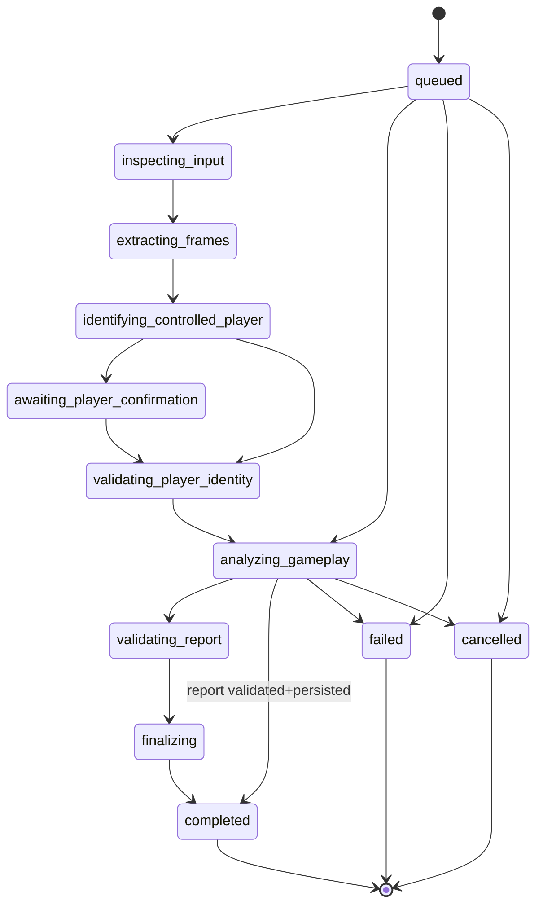

# Scotty Step 6 — Durable Postgres analysis jobs & restart recovery

Step 6 makes ChelCoach Postgres the **canonical system of record** for analysis
ownership, lifecycle ordering, idempotency, confirmation/cancellation, failures,
report persistence, and restart recovery.

**Out of scope:** Cloudflare, live Scotty HTTP, production HMAC, browser reload
recovery / polished polling (Step 7), final report UI.

## Authority

```text
Application (Postgres)     Provider (simulator now / HTTP later)
─────────────────────      ────────────────────────────────────
ownership                  remote execution state
upload association         external job ID
idempotency / fingerprint  lifecycle events
lifecycle history          report output
safe errors / reports
frontend access control
```

Status synchronization reconciles provider state **into** ChelCoach persistence.
The provider cannot bypass ownership rules.

## Architecture

```text
Frontend
  → ChelCoach analysis API
  → Postgres application job
  → ScottyProvider (recorded per job)
  → synchronizeJob()
  → Postgres canonical state
  → safe public response
```

## Schema

| Table | Role |
|---|---|
| `scotty_analysis_jobs` | Canonical job record (versioned, sequence-safe) |
| `scotty_analysis_job_events` | Append-only history |
| `scotty_analysis_reports` | Validated report JSON + checksum |
| `scotty_simulator_jobs` | Durable simulator execution state |
| `scotty_callback_events` | Callback event-ID dedupe foundation |

Migration: `server/drizzle/0000_scotty_durable_jobs.sql`

### Key indexes

- `application_request_id` unique
- `idempotency_key` unique
- `(provider, external_job_id)` unique
- `(owner_id, application_request_id)`
- `(canonical_status, next_sync_after)`
- `(reconciliation_required, updated_at)`

## Status ordering

Central evaluator: `evaluateProviderStatusUpdate`.

| Decision | Meaning |
|---|---|
| `advance` | Persist higher sequence |
| `idempotent` | Equal sequence + same status |
| `stale` | Lower sequence ignored |
| `conflict` | Equal sequence + different status |
| `reject` | Illegal / terminal regression |
| `requires_report_fetch` | Provider completed → fetch, validate, persist report, then complete |

Optimistic concurrency uses a `version` column (compare-and-swap) plus row locks
in the Drizzle repository.



## Submission transaction

1. Create durable pending job (before provider call)
2. Acquire short-lived processing lease
3. Call `provider.submitAnalysis()`
4. Persist acceptance + external job ID
5. On timeout/network: `acceptance_unknown` + `reconciliationRequired`
6. Retry reuses the same idempotency key

## Provider after restart

Each job stores `provider`. Synchronization uses
`createScottyProviderForMode(job.provider)` — never the global default alone,
and never remaps to another provider.

## Simulator restart

Preferred strategy: persist simulator execution rows in `scotty_simulator_jobs`
(acceptedAt, scenario, confirmation/cancel, failure point, report, sequence).
Lifecycle remains elapsed-time derived via `deriveSimulatorJobState`.

When `DATABASE_URL` is set, `wirePersistence()` installs
`DrizzleSimulatorJobRepository`.

## Reconciliation

`AnalysisReconciliationService.runBatch({ limit })`:

- bounded candidate query
- per-job in-flight guard + DB row locks
- provider-independent `synchronizeJob`

**Scheduling foundation:** `POST /api/internal/analysis/reconcile` with
`x-chelcoach-reconcile-secret`. Suggested production cadence: once per minute
via external cron. Do not create one timer per job.

## Callbacks

Still disabled for processing. When the flag is on, unsigned requests are
rejected; accepted events are deduped in `scotty_callback_events`. Stale /
conflicting sequences are classified without mutating history incorrectly.

## Retention interaction

Active jobs do not hold processing leases for the full analysis duration.
If source media is deleted/expired before a report is stored, the job fails
safely with `MEDIA_ALREADY_DELETED`. Absolute retention is not extended by
abandoned jobs.

## Public response

Includes status label, poll delay, action/report/cancel availability, degraded
flag. Omits idempotency key, fingerprint, provider URL, storage keys, secrets.

## Known remaining risks

- Browser reload / durable client polling is Step 7
- Callback processing is not activated
- Multi-instance reconciliation relies on row locks + candidate limits
- CI memory tests always run; Postgres integration runs when
  `CHELCOACH_RUN_PG_TESTS=1` + `DATABASE_URL` are set
