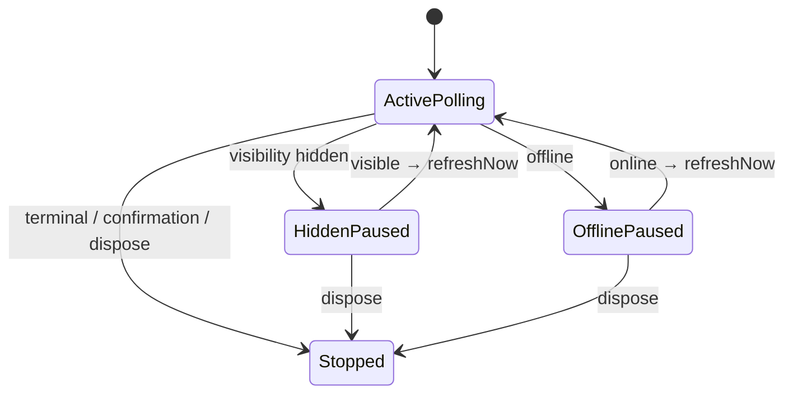
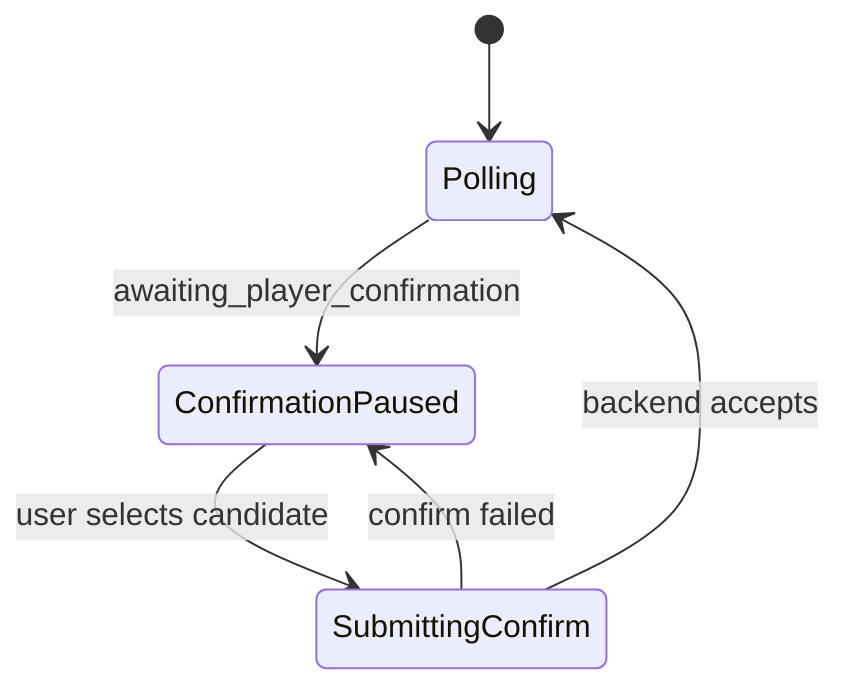
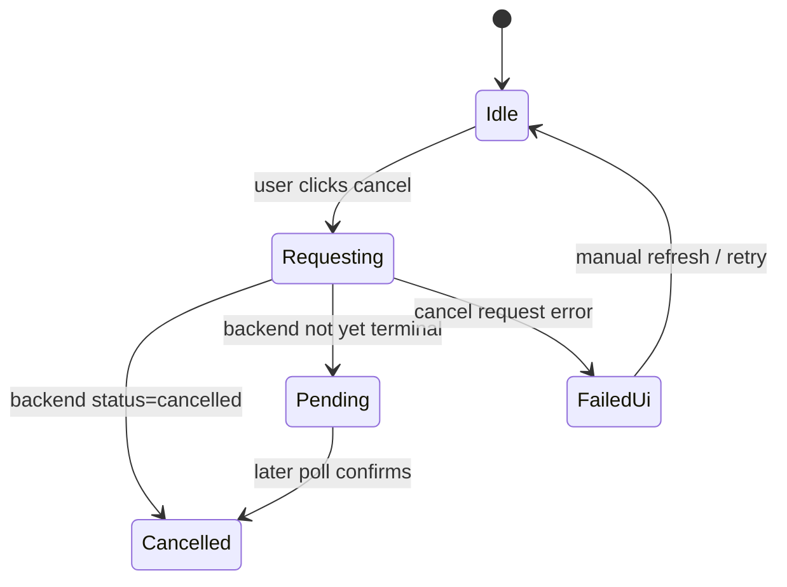
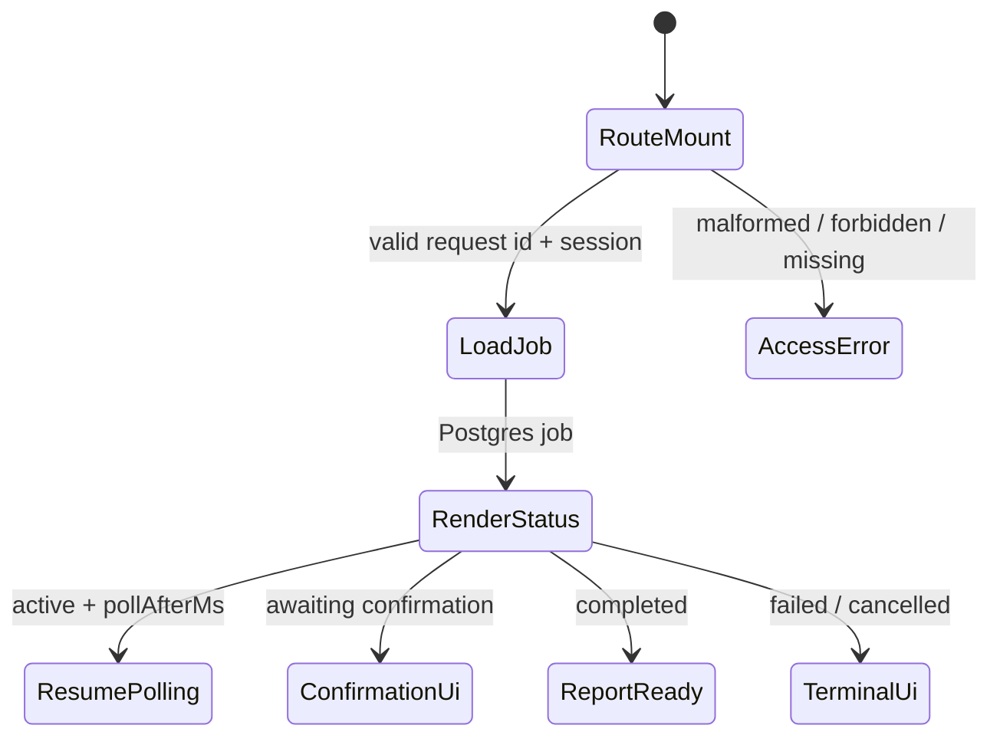

# Scotty Step 7 — Resumable browser polling & reload recovery

Step 7 makes the browser experience restart-safe for multi-minute analyses.
The durable Postgres application job from Step 6 remains the **source of truth**.
The browser never becomes authoritative for analysis state.

**Out of scope:** Cloudflare, live Scotty HTTP, callbacks, final report design,
push/email notifications, analysis history dashboard, Step 8/9 E2E provider tests.

## Durable route recovery

```text
POST /api/uploads/:uploadId/analysis
  → applicationRequestId
  → navigate /analysis/{applicationRequestId}
  → GET durable status from Postgres
  → poll using server pollAfterMs
  → refresh / tab close / reopen
  → same route recovers job without local storage
```

Canonical routes:

| Route | Role |
|---|---|
| `/analysis/:applicationRequestId` | Status + confirmation + cancel |
| `/analysis/:applicationRequestId/confirm-player` | Same status screen (embedded confirmation) |
| `/analysis/:applicationRequestId/report` | Step 7 basic persisted report shell |

The application request ID is opaque. URLs must not contain provider job IDs,
idempotency keys, storage keys, owner IDs, or secrets.

Legacy `/analysis-status?requestId=` redirects to the durable path.

## Backend authority

Authoritative fields come only from ChelCoach API responses:

* status, status sequence, labels/messages
* report / cancellation availability
* user-action-required, terminal, degraded
* poll-after milliseconds, safe errors

Frontend may hold transient UI state (loading, dismissals, selected candidate).
It must not invent or permanently override job status.

## Poll scheduling

Primary input: server `pollAfterMs`.

| Rule | Behavior |
|---|---|
| `null` | Do not auto-poll |
| `< 1000ms` | Clamp to `MIN_CLIENT_POLL_MS` (1000) |
| `> 15000ms` | Clamp to `MAX_CLIENT_POLL_MS` (15000) |
| Terminal / confirmation | Stop automatic polling |
| Manual refresh | Always allowed when mounted |

### Expected request volume

| Scenario | Automatic requests |
|---|---|
| One active visible tab | ~1 per clamped `pollAfterMs` |
| One hidden tab | 0 while hidden; 1 immediate refresh on visible |
| Terminal / confirmation job | 0 after the response that observed that state |

## Sequence handling & races

1. Higher `statusSequence` replaces current view.
2. Equal sequence may update safe metadata (`updatedAt`, degraded, poll delay).
3. Lower sequence is ignored (including suspicious lower terminal responses).
4. Each status fetch has a request generation; older resolutions are discarded.

## Visibility & offline



Offline and transport failures show a connection warning and **preserve** the last
durable status. They never locally mark the job `failed`.

## Transient retry

Backoff: `1s → 2s → 4s → 8s → 15s` (+ jitter), capped.
Failure count resets after a successful response.

## Confirmation recovery



Provider-level confirmation uses:

`POST /api/analysis/:applicationRequestId/player-confirmation`

Upload-level Step 3 confirmation remains a separate API and UI flow.

## Cancellation recovery



No optimistic cancelled state before backend confirmation.

## Reload recovery



## Frontend testing

Foundation: Vitest + React Testing Library + jsdom.

* Fake timers / injected clock, schedule, visibility, connectivity, API
* Route recovery tests without local/session storage
* Poller unit tests for overlap, abort, backoff, sequence races

## Remaining risks

* Multi-tab confirmation/cancel races rely on backend idempotency (correct).
* Session restore UX uses upload return path as a temporary recovery entry.
* Report shell is intentionally minimal until Step 8.
* Optional active-job banner / list endpoint not implemented (not required for correctness).

## Step 8 inputs

* Persisted `ScottyReport` from `GET /api/analysis/:id/report`
* Durable status already exposes `reportAvailable`
* Stage presentation map and accessibility live region
* No provider calls from the report route after persistence
